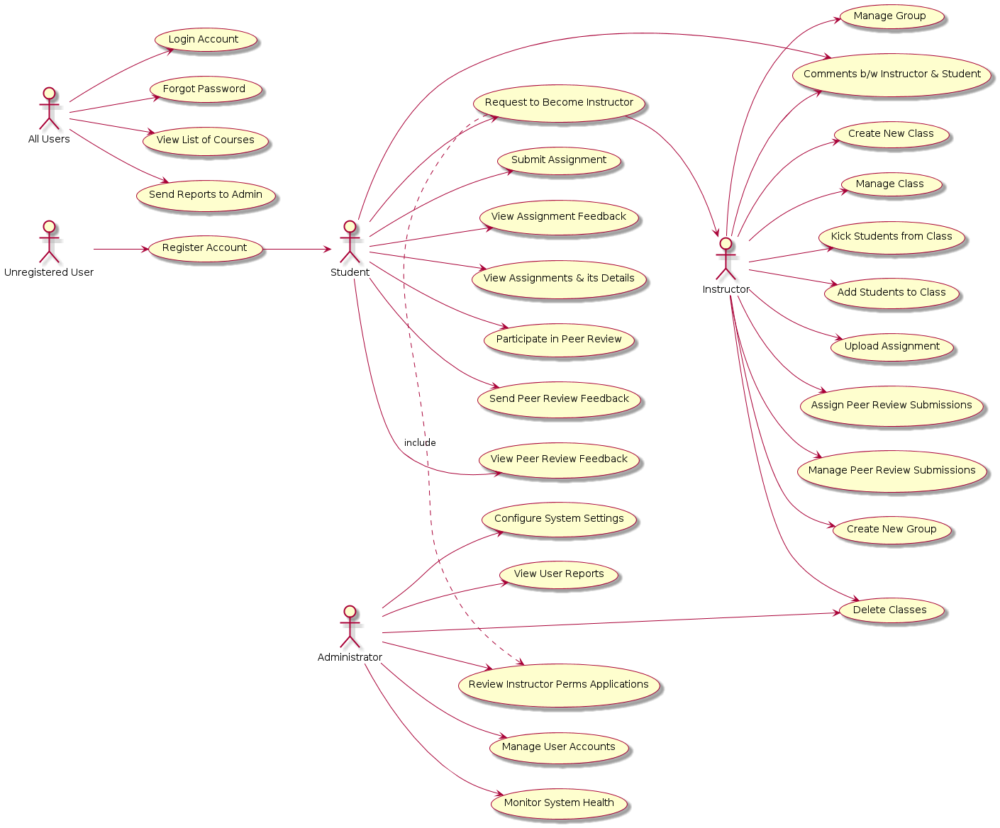

# System Design

## Introduction

In this project, we are developing a user-friendly educational platform designed to streamline the classroom experience for both teachers and students. Our application focuses primarily on the peer-review and assignment management processes, making it easy for teachers to create and manage assignments while enabling students to submit their work and participate in peer reviews. Additionally, the platform includes classroom management features, allowing teachers to organize classes and enroll students. Grading management is also a key aspect, providing tools for teachers to grade assignments efficiently and deliver feedback to students. By providing an integrated tool for these tasks, we aim to enhance the educational process through efficient classroom management, timely notifications, and effective communication between all participants.

**High-Level Usage Scenarios**: 
1. **User Management**: Secure registration, login, and profile management.
2. **Classroom Management**: Create and manage classes, enroll students.
3. **Assignment Management**: Create assignments, track submissions.
4. **Submission Process**: Submit assignments, view submission status.
5. **Review Management**: Conduct peer reviews, provide feedback.
6. **Notification Services**: Receive email and in-app notifications.

## System Architecture Design 

For our project, we will be applying a hybrid of the **Modular Monolith** and **Microservices** architecture patterns. Since we are not sure about the feasabilty or difficulty of a micro-services approach, we are going to start the development process with a standard 3-part architecture: **Front-end service, Back-end service, and a Database**. The Front-end service, or **Client Web Interfaces** will be a React based web-server which will serve front-end content and communicate with the back-end VIA api endpoints. The Back-end service, or the **Core Service Monolith** will provide all of the functionailites of the application and will be seperated into **modules**. These main modules/services are:

* The ***API Gateway / Reverse Proxy*** module...
>    * will facilitate communication between the client (**Front-end service**) and the backend services (**Core Service Monolith**). It will handle routing of requests to the appropriate modules and provide a single entry point for all client requests (may also load balance and rate limit). Additionally, it will manage authentication and authorization by directing these requests to the Authentication module.
* The ***Authentication*** module... 
>    * will manage user login, registration, and authentication processes. It will handle JWT generation and validation (passport.js), ensuring secure access to the application's resources. It will also manage user roles and permissions, providing role-based access control to different parts of the **Core Service Monolith**. 
* The ***Notification*** module...
>    * will be responsible for sending notifications to users. This will include email notifications for account verification, password reset, assignment dead-lines, and review updates. It will interface with an SMTP server or a third-party email service provider to send out these notifications.
* The ***Main*** module... (User, Assignment, and Classroom Operations)
>    * will handle the core instructor and basic user functionalites. This module will manage user profiles, user group assignments, class creation and enrollment, and the creation and management of assignments.
* The ***Submission*** module...
>    * will manage the process of students submitting assignments. This module will handle repeat submissions, various submission formats and restrict submissions to certian file-types. It will also manage the status of submissions and provide feedback to users on their submissions
* The ***Feedback*** module...
>    * will handle the creation and management of feedback on assignment submissions. It will allow reviewers to provide comments and grades on submitted assignments. This module will ensure that feedback is stored and associated with the correct submission and user. 

Since the **Modular Monolith** approach doesn't have to consider isolated inter-service communication, a highly complex API gateway, or other complexities when developing a microservices application, it seems like the best approach to start for development (We can just start developing features on the back-end and begin splitting them into modules). As we continue, if we are making modules quickly, generally isolated, and not extremely overloaded nor complex, we may shift into more of a **Microservices** approach since they favor scalability and also relability (if one of your services goes down, the rest can still run).

> :star: *The dotted lines outside a service represent a docker container*

## System Architecture Design: *Modular Monolith*

## System Architecture Design: *Modular Monolith w/ Microservices*

## System Architecture Design: *Microservices*

## Use Case Models

| Use Case ID | Use Case Name                        | Actor(s)            |
|-------------|--------------------------------------|---------------------|
| 1           | Register Account                     | All Users           |
| 2           | Login Account                        | All Users           |
| 3           | Forgot Password                      | All Users           |
| 4           | View List of Courses                 | All Users           |
| 5           | Send Reports to Admin                | All Users           |
| 6           | Submit Assignment                    | Student             |
| 6.a         | Comments b/w Instructor & Student    | Student, Instructor |
| 7           | View Assignment Feedback             | Student             |
| 8           | View Assignments & its Details       | Student             |
| 9           | Participate in Peer Review           | Student             |
| 9.a         | Send Peer Review Feedback            | Student             |
| 9.b         | View Peer Review Feedback            | Student             |
| 9.c         | Assign Peer Review Submissions       | Instructor          |
| 9.d         | Manage Peer Review Submissions       | Instructor          |
| 10          | Request to Become Instructor         | Student             |
| 11          | Create New Group                     | Student, Instructor |
| 12          | Manage Group                         | Student, Instructor |
| 13          | Join Group                           | Student             |
| 14          | Create New Class                     | Instructor          |
| 15          | Manage Class                         | Instructor          |
| 15.a        | Kick Students from Class             | Instructor          |
| 15.b        | Add Students to Class                | Instructor          |
| 16          | Upload Assignment                    | Instructor          |
| 17          | View Class Dashboard                 | Student, Instructor |
| 18          | View Student's Progress              | Student, Instructor |
| 19          | Delete Classes                       | Instructor, Administrator |
| 20          | Manage User Accounts                 | Administrator       |
| 21          | Monitor System Health                | Administrator       |
| 22          | Configure System Settings            | Administrator       |
| 23          | Review Instructor Perms Applications | Administrator       |
| 24          | View User Reports                    | Administrator       |

| ID:             | 1                             |
|-----------------|-------------------------------|
| Name:           | Register Account              |
| Actor(s):       | All Users                     |
| Flow of Events: |                               |
|                 | 1. User navigates to the registration page. |
|                 | 2. User fills out the registration form and submits it. |
|                 | 4. System creates a new account and sends a confirmation email. |
| Pre-Conditions: |                               |
|                 | 1. User must have a valid email address. |
| Post-Conditions:|                               |
|                 | 1. A new account is created. |
| Description:    | This use case describes how a new user registers for an account. |

| ID:             | 2                             |
|-----------------|-------------------------------|
| Name:           | Login Account                 |
| Actor(s):       | All Users                     |
| Flow of Events: |                               |
|                 | 1. User navigates to the login page. |
|                 | 2. User enters their credentials and submits the form. |
|                 | 3. System authenticates the user and grants access. |
| Pre-Conditions: |                               |
|                 | 1. User must be registered. |
|                 | 2. User must have valid login credentials. |
| Post-Conditions:|                               |
|                 | 1. User is logged into the system. |
| Description:    | This use case describes how a user logs into their account. |

| ID:             | 3                             |
|-----------------|-------------------------------|
| Name:           | Forgot Password               |
| Actor(s):       | All Users                     |
| Flow of Events: |                               |
|                 | 1. User navigates to the forgot password page. |
|                 | 2. User enters their registered email address and submits the form. |
|                 | 3. System sends a password reset link to the user's email. |
| Pre-Conditions: |                               |
|                 | 1. User must be registered. |
| Post-Conditions:|                               |
|                 | 1. User receives a password reset link. |
| Description:    | This use case describes how a user requests a password reset. |

| ID:             | 4                             |
|-----------------|-------------------------------|
| Name:           | View List of Courses          |
| Actor(s):       | All Users                     |
| Flow of Events: |                               |
|                 | 1. User navigates to the Classes page. |
|                 | 2. System displays a list of courses they're enrolled in (Student), classes they teach (Instructor), or all courses (Admin). |
|                 | 3. User can now search for a specific course. |
| Pre-Conditions: |                               |
|                 | 1. User must be logged into the system. |
| Post-Conditions:|                               |
|                 | 1. User views the list of available courses. |
| Description:    | This use case describes how users view the list of available courses. |

| ID:             | 5                             |
|-----------------|-------------------------------|
| Name:           | Send Reports to Admin         |
| Actor(s):       | All Users                     |
| Flow of Events: |                               |
|                 | 1. User clicks the report button (which is present on every page). |
|                 | 2. User fills out the report form and submits it. |
|                 | 3. System sends the report to the administrator. |
| Pre-Conditions: |                               |
|                 | 1. User must be logged into the system. |
| Post-Conditions:|                               |
|                 | 1. Administrator receives the report. |
| Description:    | This use case describes how users send reports to the administrator. |

| ID:             | 6                             |
|-----------------|-------------------------------|
| Name:           | Submit Assignment             |
| Actor(s):       | Student                       |
| Flow of Events: |                               |
|                 | 1. Student navigates to the assignment submission page. |
|                 | 2. Student uploads the assignment file. |
|                 | 3. Student submits the assignment. |
|                 | 4. System records the submission and notifies the instructor. |
| Pre-Conditions: |                               |
|                 | 1. Student must be logged into the system. |
|                 | 2. Student must be enrolled in the course. |
| Post-Conditions:|                               |
|                 | 1. Assignment is submitted and recorded. |
| Description:    | This use case describes how students submit assignments. |

| ID:             | 6.a                           |
|-----------------|-------------------------------|
| Name:           | Comments b/w Instructor & Student   |
| Actor(s):       | Student                       |
| Flow of Events: |                               |
|                 | 1. Student/instructor navigates to the comments section of a particular assignment's page. |
|                 | 2. Student/instructor writes the comment. |
|                 | 3. Student/instructor submits the comment. |
|                 | 4. System sends the comment to the Student/instructor. |
| Pre-Conditions: |                               |
|                 | 1. Student/instructor must be logged into the system. |
| Post-Conditions:|                               |
|                 | 1. Student/instructor receives the comment. |
| Description:    | This use case describes how students & instructors can send comments to each other under a certain assignment. |

| ID:             | 7                             |
|-----------------|-------------------------------|
| Name:           | View Assignment Feedback      |
| Actor(s):       | Student                       |
| Flow of Events: |                               |
|                 | 1. Student navigates to a particular assignment's page. |
|                 | 2. Student is able to see comments next to where their submission is displayed. |
| Pre-Conditions: |                               |
|                 | 1. Student has submitted the assignment. |
|                 | 2. Instructor has given the student feedback on their assignment. |
| Post-Conditions:|                               |
|                 | 1. Student will have seen their submission's feedback. |
| Description:    | This use case describes how students will be able to see their instructor's feedback on their assignment submissions. |

| ID:             | 8                             |
|-----------------|-------------------------------|
| Name:           | View Assignments & its Details|
| Actor(s):       | Student                     |
| Flow of Events: |                               |
|                 | 1. Student navigates to the assignments page. |
|                 | 2. Student selects a specific assignment to view its details. |
|                 | 3. System displays the assignment details, including instructions, due date, and the rubric. |
| Pre-Conditions: |                               |
|                 | 1. Student must be logged into the system and be enrolled in a class. |
|                 | 1. Instructor must have upload an assignment for the class. |
| Post-Conditions:|                               |
|                 | 1. Student views the details of the selected assignment. |
| Description:    | This use case describes how students view details of their assignments. |

| ID:             | 9.a                           |
|-----------------|-------------------------------|
| Name:           | Send Peer Review Feedback    |
| Actor(s):       | Student                     |
| Flow of Events: |                               |
|                 | 1. Student navigates to the peer review feedback section for a specific submission. |
|                 | 2. Student provides feedback on the submission according to provided guidelines. |
|                 | 3. Student submits the feedback. |
| Pre-Conditions: |                               |
|                 | 1. Student must be logged into the system. |
| Post-Conditions:|                               |
|                 | 1. Feedback is submitted to the system. |
| Description:    | This use case describes how students send feedback during the peer review process. |

| ID:             | 9.b                           |
|-----------------|-------------------------------|
| Name:           | View Peer Review Feedback    |
| Actor(s):       | Student                     |
| Flow of Events: |                               |
|                 | 1. Student navigates to the peer review feedback section for their submission. |
|                 | 2. System displays feedback received from peers. |
| Pre-Conditions: |                               |
|                 | 1. Student must be logged into the system. |
| Post-Conditions:|                               |
|                 | 1. Student views feedback received from peers. |
| Description:    | This use case describes how students view feedback received during the peer review process. |

| ID:             | 9.c                           |
|-----------------|-------------------------------|
| Name:           | Assign Peer Review Submissions |
| Actor(s):       | Instructor                  |
| Flow of Events: |                               |
|                 | 1. Instructor navigates to the peer review assignment settings. |
|                 | 2. Instructor assigns submissions to students for peer review. |
| Pre-Conditions: |                               |
|                 | 1. Instructor must be logged into the system. |
|                 | 2. Peer review process must be enabled for the assignment. |
| Post-Conditions:|                               |
|                 | 1. Submissions are assigned to students for peer review. |
| Description:    | This use case describes how instructors assign submissions to students for peer review. |

| ID:             | 9.d                           |
|-----------------|-------------------------------|
| Name:           | Manage Peer Review Submissions |
| Actor(s):       | Instructor                  |
| Flow of Events: |                               |
|                 | 1. Instructor navigates to the peer review assignment settings. |
|                 | 2. Instructor manages submissions assigned for peer review, which may include reviewing, reassigning, or closing the peer review process. |
| Pre-Conditions: |                               |
|                 | 1. Instructor must be logged into the system. |
|                 | 2. Peer review process must be enabled for the assignment. |
| Post-Conditions:|                               |
|                 | 1. Peer review submissions are managed according to instructor actions. |
| Description:    | This use case describes how instructors manage submissions assigned for peer review. |

| ID:             | 10                            |
|-----------------|-------------------------------|
| Name:           | Request to Become Instructor |
| Actor(s):       | Student                     |
| Flow of Events: |                               |
|                 | 1. Student navigates to the "Request Instructor" section on the Settings page. |
|                 | 2. Student fills out the request form. |
|                 | 3. Student submits the request. |
| Pre-Conditions: |                               |
|                 | 1. Student must be logged into the system. |
| Post-Conditions:|                               |
|                 | 1. Request is submitted for review. |
| Description:    | This use case describes how students request to become an instructor. |

| ID:             | 11                            |
|-----------------|-------------------------------|
| Name:           | Create New Group             |
| Actor(s):       | Student, Instructor         |
| Flow of Events: |                               |
|                 | 1. User navigates to the "Create Group" section on their class's page. |
|                 | 2. User provides group details like name, description, and members. |
|                 | 3. User submits the form to create the group. |
| Pre-Conditions: |                               |
|                 | 1. User must be logged into the system. |
| Post-Conditions:|                               |
|                 | 1. New group is created. |
| Description:    | This use case describes how users create a new group. |

| ID:             | 12                            |
|-----------------|-------------------------------|
| Name:           | Manage Group                 |
| Actor(s):       | Student, Instructor         |
| Flow of Events: |                               |
|                 | 1. User navigates to the group in question under 'Groups' on the class' page. |
|                 | 2. User selects a group to manage. |
|                 | 3. User performs actions like adding/removing members, changing group settings, etc. |
| Pre-Conditions: |                               |
|                 | 1. User must be logged into the system. |
| Post-Conditions:|                               |
|                 | 1. Group settings are updated as per user actions. |
| Description:    | This use case describes how users manage a group they are part of. |

| ID:             | 13                             |
|-----------------|-------------------------------|
| Name:           | Join Group                    |
| Actor(s):       | Student                       |
| Flow of Events: |                               |
|                 | 1. Student navigates to the groups page. |
|                 | 2. Student selects the group they wish to join. |
|                 | 3. System adds the student to the group. |
| Pre-Conditions: |                               |
|                 | 1. Student must be logged into the system. |
| Post-Conditions:|                               |
|                 | 1. Student joins the group or a join request is sent. |
| Description:    | This use case describes how students join a group. |

| ID:             | 14                             |
|-----------------|-------------------------------|
| Name:           | Create New Class              |
| Actor(s):       | Instructor                    |
| Flow of Events: |                               |
|                 | 1. Instructor clicks the '+' button on the Classes page. |
|                 | 2. Instructor fills out the class details and submits the form. |
|                 | 3. System creates the new class and adds it to the instructor's dashboard. |
| Pre-Conditions: |                               |
|                 | 1. Instructor must be logged into the system. |
| Post-Conditions:|                               |
|                 | 1. A new class is created. |
| Description:    | This use case describes how instructors create a new class. |

| ID:             | 15                             |
|-----------------|-------------------------------|
| Name:           | Manage Class                  |
| Actor(s):       | Instructor                    |
| Flow of Events: |                               |
|                 | 1. Instructor navigates to the particular class' page. |
|                 | 2. Instructor clicks the Edit button. |
|                 | 3. Instructor can edit class details, add/remove students, etc. |
| Pre-Conditions: |                               |
|                 | 1. Instructor must be logged into the system. |
| Post-Conditions:|                               |
|                 | 1. Class settings are updated as per instructor actions. |
| Description:    | This use case describes how instructors manage a class. |

| ID:             | 15.a                           |
|-----------------|-------------------------------|
| Name:           | Kick Students from Class      |
| Actor(s):       | Instructor                    |
| Flow of Events: |                               |
|                 | 1. Instructor navigates to the People section on the class' page. |
|                 | 2. Instructor clicks the Kick button present next to each student they wish to remove. |
|                 | 3. System removes the selected students from the class. |
| Pre-Conditions: |                               |
|                 | 1. Instructor must be logged into the system. |
| Post-Conditions:|                               |
|                 | 1. Selected students are removed from the class. |
| Description:    | This use case describes how instructors remove students from a class. |

| ID:             | 15.b                           |
|-----------------|-------------------------------|
| Name:           | Add Students to Class         |
| Actor(s):       | Instructor                    |
| Flow of Events: |                               |
|                 | 1. Instructor navigates to the People section on the class' page. |
|                 | 2. Instructor selects the students to be added to the class from a list of all Students in the system. |
|                 | 3. System adds the selected students to the class. |
| Pre-Conditions: |                               |
|                 | 1. Instructor must be logged into the system. |
| Post-Conditions:|                               |
|                 | 1. Selected students are added to the class. |
| Description:    | This use case describes how instructors add students to a class. |

| ID:             | 16                             |
|-----------------|-------------------------------|
| Name:           | Upload Assignment             |
| Actor(s):       | Instructor                    |
| Flow of Events: |                               |
|                 | 1. Instructor navigates to the class's Edit/Data page. |
|                 | 2. Instructor clicks the Add Assignment button. |
|                 | 3. Instructor fills out the assignment details (incl. rubric) and uploads any necessary files. |
|                 | 4. Instructor submits the assignment. |
|                 | 5. System makes the assignment available to students in the class. |
| Pre-Conditions: |                               |
|                 | 1. Instructor must be logged into the system. |
| Post-Conditions:|                               |
|                 | 1. Assignment is uploaded and available to students. |
| Description:    | This use case describes how instructors upload assignments for their classes. |

| ID:             | 17                             |
|-----------------|-------------------------------|
| Name:           | View Class Dashboard          |
| Actor(s):       | Student, Instructor           |
| Flow of Events: |                               |
|                 | 1. User navigates to the class' home page. |
|                 | 2. System displays an overview of the class, including assignments, announcements, and grades. |
| Pre-Conditions: |                               |
|                 | 1. User must be logged into the system. |
|                 | 2. User must be enrolled in or teaching the class. |
| Post-Conditions:|                               |
|                 | 1. User views the class dashboard. |
| Description:    | This use case describes how users view the dashboard of a class they are enrolled in or teaching. |

| ID:             | 18                             |
|-----------------|-------------------------------|
| Name:           | View Student's Progress |
| Actor(s):       | Student, Instructor           |
| Flow of Events: |                               |
|                 | 1. Student navigates to their class' page and goes to the People section. |
|                 | 2. Instructor clicks on a student whose stats they wish to see. |
|                 | 3. System displays an overview of the student's progress, including completed assignments, grades, and feedback. |
| Pre-Conditions: |                               |
|                 | 1. User must be logged into the system. |
| Post-Conditions:|                               |
|                 | 1. User views the student's progress. |
| Description:    | This use case describes how users view a student's progress dashboard. |

| ID:             | 19                             |
|-----------------|--------------------------------|
| Name:           | Delete Classes                 |
| Actor(s):       | Instructor, Administrator      |
| Flow of Events: |                                |
|                 | 1. Instructor/Administrator navigates to the Classes (My Classrooms) page. |
|                 | 2. Instructor/Administrator clicks the Delete button. |
|                 | 3. Instructor/Administrator confirms the action. |
|                 | 4. System deletes the selected classes. |
| Pre-Conditions: |                                |
|                 | 1. Instructor/Administrator must be logged into the system. |
| Post-Conditions:|                                |
|                 | 1. Selected classes are deleted. |
| Description:    | This use case describes how instructors/administrators delete classes. |

| ID:             | 20                             |
|-----------------|-------------------------------|
| Name:           | Manage User Accounts          |
| Actor(s):       | Administrator                 |
| Flow of Events: |                               |
|                 | 1. Administrator navigates to the user accounts management page. |
|                 | 2. Administrator performs actions like creating, editing, or deleting user accounts. |
| Pre-Conditions: |                               |
|                 | 1. Administrator must be logged into the system. |
| Post-Conditions:|                               |
|                 | 1. User accounts are managed as per administrator actions. |
| Description:    | This use case describes how administrators manage user accounts. |

| ID:             | 21                             |
|-----------------|-------------------------------|
| Name:           | Monitor System Health         |
| Actor(s):       | Administrator                 |
| Flow of Events: |                               |
|                 | 1. Administrator navigates to the system health monitoring page. |
|                 | 2. System displays the current status of various system components. |
| Pre-Conditions: |                               |
|                 | 1. Administrator must be logged into the system. |
| Post-Conditions:|                               |
|                 | 1. Administrator monitors the health of the system. |
| Description:    | This use case describes how administrators monitor the health of the system. |

| ID:             | 22                             |
|-----------------|-------------------------------|
| Name:           | Configure System Settings     |
| Actor(s):       | Administrator                 |
| Flow of Events: |                               |
|                 | 1. Administrator navigates to the Settings page. |
|                 | 2. Administrator changes settings as needed. |
|                 | 3. Administrator saves the changes. |
| Pre-Conditions: |                               |
|                 | 1. Administrator must be logged into the system. |
| Post-Conditions:|                               |
|                 | 1. System settings are updated. |
| Description:    | This use case describes how administrators configure system settings. |

| ID:             | 23                             |
|-----------------|-------------------------------|
| Name:           | Review Instructor Perms Applications |
| Actor(s):       | Administrator                 |
| Flow of Events: |                               |
|                 | 1. Administrator receives e-mails of the permissions upgrade requests submitted by Users. |
|                 | 2. Administrator reviews the submitted applications. |
|                 | 3. Administrator approves (by upgrading User to Instructor) or rejects the applications. |
| Pre-Conditions: |                               |
|                 | 1. Administrator must be logged into the system. |
| Post-Conditions:|                               |
|                 | 1. Applications are approved or rejected. |
| Description:    | This use case describes how administrators review and respond to applications for instructor permissions. |

| ID:             | 24                             |
|-----------------|-------------------------------|
| Name:           | View User Reports             |
| Actor(s):       | Administrator                 |
| Flow of Events: |                               |
|                 | 1. Administrator navigates to the user reports page. |
|                 | 2. System displays the reports submitted by users. |
| Pre-Conditions: |                               |
|                 | 1. Administrator must be logged into the system. |
| Post-Conditions:|                               |
|                 | 1. Administrator views the user reports. |
| Description:    | This use case describes how administrators view reports submitted by users. |

### Use Case Diagram

This Use Case Diagram illustrates an educational platform's functionalities and user interactions. It identifies five user roles: All Users, Unregistered Users, Students, Instructors, and Administrators. All Users can perform basic actions like logging in, viewing courses, and sending reports. Unregistered Users can register to become Students, who can then participate in peer reviews, submit assignments, and request to become Instructors. Instructors manage assignments, peer reviews, classes, and student groups, and can communicate directly with students. Administrators oversee the platform's operation, managing user accounts, reviewing instructor applications, monitoring system health, and configuring system settings. The diagram also shows dependencies between actions, such as how viewing peer review feedback includes participating in peer reviews and sending feedback.

## Database Design 

Provide an ER diagram of the entities and relationships you anticipate having in your system (this will most likely change, but you need a starting point).  In a few sentences, explain why the data is modelled this way and what is the purpose of each table/attribute.  For this part, you only need to have ONE diagram and an explanation.

## Data Flow Diagram (Level 0/Level 1)

### Level 0 DFD

Here, we have the Level 0 DFD representing the PeerGrade system! We have the three main user types represented here as well: Students, Instructors, and Administrators. The PeerGrade system acts as the central process, facilitating data flows such as: Students submit assignments, receive feedback, request to join classes, and create groups, while instructors manage assignments, provide feedback, and create classroom and groups. Admins oversee system management, process reports, and upgrade user 

### Level 1 DFD

For the Level 1 DFD, Entites stay the same as Student (Default User), Instructor, and Admin. Within the Level 1 DFD there are 8 main processes (Classroom, Authorization, Authentication, Student Assignment, Instructor Assignment, Review, Notification, and System Management). These processes are meant to be similar to the modules of the Modular Monolith design, and can be mappped as such: 

* **Authentication module** = *Authorization and Authentication Process*
* **Notification module** = *Notification and System Management Process*
* **Main module** = *Classroom, User, and Instructor Assignment Process*
* **Submission module** = *Student Assignment Process*
* **Feedback module** = *Review Process* 

The system border is represented as a *dotted line*. The Data-stores are represented as *pink rectangles* and together they represent all represent the database. Any :red_square: **pink data flow** represents the *storage and retrevial* of data from a Data-Store. Any :blue_square: **blue data flow** represents a data flow that ***ALL*** users can perform. 

## User Interface (UI) Design

### Please use the following [Figma link](https://www.figma.com/design/DDBLqkl7hRm70yKNdcwFI1/PeerGrade---T10-team-library?node-id=0-1&t=YI9mMfqX5viX6LEv-1) for a comprehensive view of our UI

MVP Flow diagram:

# PeerGrade Wireframes:
* Our client has expressed that only desktop views are required for this project therefore, no mobile views have been created.
  
## Login UI
* A nice-to-have feature - CWL type login to use and enter the platform however, the bare minimum will provide an authenticated login service with user differentiation of student/instructor/admin.

## Dashboard UI
* The Dashboard page is the first page accessed after a successful user login. It facilitates easy access to active classes and upcoming assignments with further navigation hosted on the navbar. The navbar also includes a notifications panel for viewing recent changes related to the user account and an avatar to identify the user who is logged in. 

## Classes UI
The Class page consists of a variety of data and access links:
1. A classroom navigation for the Home Page, Grades Page, Peoples Page, Groups Page, and Files Page.
2. (nice to have) Announcement panels for recent class announcements and new assignment notifications.
3. Categorized panels to differentiate assignments by weeks/units/however the instructor may name the categories on creation.
4. Class statistics (Class grade view card, average peer grade card)
5. (nice to have) Side action buttons
6. (nice to have) To do a panel

* Hovering over the document icon presents an info message related to the document progress status in terms of grading (For example: "is being graded", "graded", "peer-review grades pending", etc)

## Assignment Page UI
The assignments page hosts the functionality to view assignment details and submit an assignment. A nice-to-have feature will be hosting assignment comments.
* Under the comments panel, we have a submission attempts view to view all attempted file submissions submitted by the user/student

## Peer-Reviews UI
* A view to see all peer reviews assigned to a student.
* host a card view and a list view.
* A search bar to filter search assignment titles and view filtered results
* A drop-down menu to select a class and view a specific class's peer-reviewed assignments.

## Viewing/submitting review UI
* A view to view the assignment and download a peer-reviewed document (and view the rubric marks) of each peer-reviewer that leaves a review.
* A filter bar to select a specific review to view (if not selected, it is listed in date-time order).

## Settings UI
* A settings panel to edit user-related details (name, email, change password) and our primary panel for admins to view system maintenance and management-related details

# Instructor Views:
## Classes UI 
* A page to manage all classes created by the instructor and the ability to create a new class

Each tab for announcements, category tabs for assignments, and adding category features will be enabled for instructors to add information wherever necessary.

## Uploading Assignment 
* An Upload assignment page for instructors to fill out assignment and rubric details and manage review selection processes for class students.

## component for selecting peer-reviewers for assignments:

