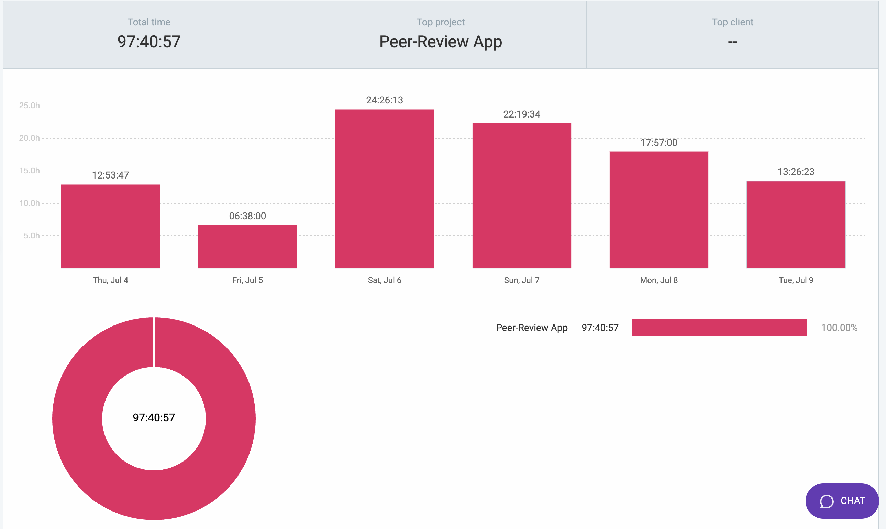
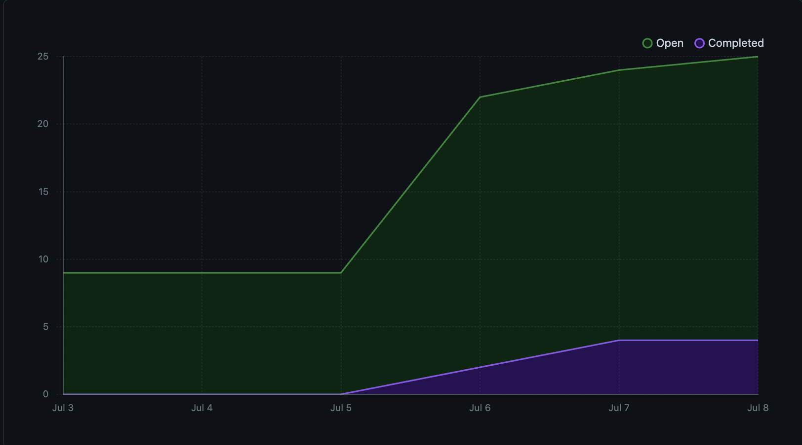
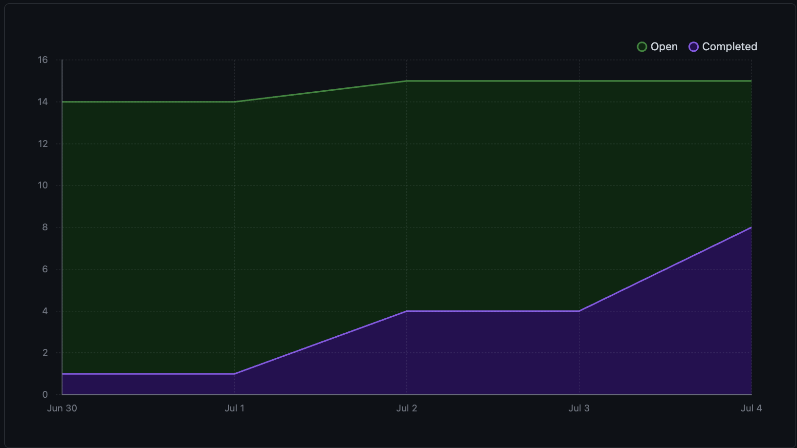

# Team 10's Team Dashboard for Cycle 13

## Thursday, July 11, 2024, 05:22 PM - Tuesday, July 16, 2024, 05:22 PM

### Major features worked on in c-13
*  
  
*  
  
*  
  

### Major features completed in c-13
*  
  
*  
  
*  
  

### Major features to work on for c-14
*  
  
*  
  
*  
  

### Team Issues and Hurdles for c-13
*  
  
*  
  
*  
  

### Clockify Dashboard for this Week

  
  

# Team 10's Team Dashboard for Cycle 12

## Tuesday, July 09, 2024, 05:21 PM - Thursday, July 11, 2024, 05:21 PM

### Major features worked on in c-12
*  Wrapper component for React Router dom elements (role-based access tweaks and 404 not found pages created)

*  Student assignment submissions and submission file upload

*  Instructor submissions view and download

*  Major UI Refactor and Design update

*  Grading logic for assignment submissions
  

### Major features completed in c-12
*  UI refactor merged onto dev. The application now hosts a new design that is more in tune with design feedback we got from our client
  
*  Assignment Submission and file upload
  
*  Instructor view of submissions made by students.
  

### Major features to work on for c-13
*  Instructor Grading for an assignment
  
*  Peer Review Grading for an assignment
  
*  Grades tab on classNav implemented with posted grades and calculating grade averages to post on the home page of each classroom

  

### Team Issues and Hurdles for c-12
* API links that remain (Grade related api links, Peer review Api links)

* Updating the UI for grades and peer reviews to flow properly
  
* Keeping on pace so that we have an 80% estimated completion on all major requirements
  
  

### Clockify Dashboard for this Week

  
  

# Team 10's Team Dashboard for Cycle 11

## Thursday, July 04, 2024, 05:22 PM - Tuesday, July 09, 2024, 05:22 PM

### Major features worked on in c-11
* Major Use Case 8: Submit Assignment (Submissions not setup yet)

* Major Use Case 16-1: Create/Manage Assignment  

* Major Use Case 16-2: Create/Manage Rubric 

* Major Use Case 12, 13: Manage, Join Group 

* Setting up a docker service to handle uploading and downloading files

* Dockerized testing environment for integration testing

### Major features completed in c-11
* Major Use Case 12, 13: Manage, Join Group 

* Major Use Case 16-1: Create/Manage Assignment (Almost done, may need factor uploads to have both assignment files and descrption files, need to also include downloading files)

* Major Use Case 16-2: Create/Manage Rubric 
  

### Major features to work on for c-12
* Major Use Case 8: Submit Assignment (Submissions not setup yet) 

* Setting up a docker service to handle uploading and downloading files

* Dockerized testing environment for integration testing

### Team Issues and Hurdles for c-11
*  Refactors to the front-end for accessing classes, created a classContext to handle 
   global state, this took a bit of refactoring to get working. 
  
*  Once we set up file downloading, submissions and assignments be completely set up.
  

### Clockify Dashboard for this Week

### Burnup Charp for This Cycle 

Removed all done tasks since the last cycle, burn up looks relatively low because of creation of lots of new tasks. We also have 5 issues that are currenty in review and will be added to the done section in the next cycle.

  
  

# Team 10's Team Dashboard for Cycle 10

## Tuesday, July 02, 2024, 05:21 PM - Thursday, July 04, 2024, 05:21 PM

### Major features worked on in c-10
* Major Use Case 6, 8: View Assignment details (This is set up) and Submit Assignment (Submissions not setup yet)
  
* Major Use Case 15: Manage Class (for instructors)
  
* Major Use Case 19: Delete class (for instructors) 

* Major Use Case 16-1: Create/Manage Assignment - linking the UI to the backend

* Major Use Case 16-2: Create/Manage Rubric - linking the UI to the backend

* Major Use Case 12, 13: Manage, Join Group 
  

### Major features completed in c-10
* Major Use Case 6: View Assignment details
  
* Major Use Case 15: Manage Class 
  
* Major Use Case 19: Delete class 

* Major Use Case 13: Join Group 

  

### Major features to work on for c-11
* Major Use Case 8: Submit Assignment (Submissions not setup yet)
    * The most crucial and difficult part about the following Major Use cases, I.E. 8 and 16-1 is going to be file handling for uploading and downloading. We are going to be setting up a service to handle this and ideally have it integrated with all of our Assignment and Submission Calls by the end of Cycle 12. 
  
* Major Use Case 16-1: Create/Manage Assignment 

* Major Use Case 16-2: Create/Manage Rubric 

* Major Use Case 12, 13: Manage, Join Group 
  

### Team Issues and Hurdles for c-10
  
*  Setting things up in time for the presentation 
  
*  Realizing we are 40-50% complete of a lot of features rather than 40-50% Complete of core features. 
  

### Clockify Dashboard for this Week

### Burnup Charp for This Cycle 

  
  

# Team 10's Team Dashboard for Cycle 9

## Thursday, June 27, 2024, 05:21 PM - Tuesday, July 02, 2024, 05:21 PM

### Major features worked on in c-9
* Major Use Case 23: Role Requests Page for Admins

* Major Use Case 16-1: Create/Manage Assignment - linking the UI to the backend

* Major Use Case 6, 8: View Assignment details (This is set up) and Submit Assignment (Submissions not setup yet)

* Major Use Case 4, 14, 17, 19ish: Create View, and Delete Classes (Delete is set up for Admin not for instructor tho)

* Major Use Case 10: Role Requests / Admin UI for accepting and denying role requests (Just need to link back-end functionalities)
  

### Major features completed in c-9
* Major Use Case 23: Role Requests Page for Admins 

* Major Use Case 4, 14, 17: Create View, and Delete Classes (Delete is set up for Admin)
  
* Major Use Case 10: Role Requests / Admin UI for accepting and denying role requests (Just need to link back-end functionalities)
  

### Major features to work on for c-10
* Major Use Case 6, 8: View Assignment details (This is set up) and Submit Assignment (Submissions not setup yet)
  
* Major Use Case 15: Manage Class (for instructors)
  
* Major Use Case 19: Delete class (for instructors) 

* Major Use Case 16-1: Create/Manage Assignment - linking the UI to the backend
  

### Team Issues and Hurdles for c-9
*  A big part of this cycle was merging all of our branches together and refactoring the scrapping of redux, we hade to change alot of our files to accomodate for this so this was the first big step in getting everything linked together
  
  

### Clockify Dashboard for this Week

  
  

# Team 10's Team Dashboard for Cycle 8

## Tuesday, June 25, 2024, 05:21 PM - Thursday, June 27, 2024, 05:21 PM

### Major features worked on in c-8
  
*  Major Use Case 10: Role Requests / Admin UI for accepting and denying role requests

*  Major Use Case 16-1: Create/Manage Assignment

*  Major Use Case 23: Role Requests Page for Admins

*  Replacing Redux with a React Context based system for the session to persist even after refreshing
  

### Major features completed in c-8

*  None
  

### Major features to work on for c-9

*  Major Use Case 23: Role Requests Page for Admins

*  Major Use Case 16-1: Create/Manage Assignment - linking the UI to the backend
  
*  Major Use Case 10: Role Requests / Admin UI for accepting and denying role requests
  

### Team Issues and Hurdles for c-8
* We ended up scraping our way of doing global state management in our UI with redux, so that has 
  set us back a bit.

* Finals as well have taken up time
  

### Clockify Dashboard for this Week

  
  

# Team 10's Team Dashboard for Cycle 7

## Sunday, June 23, 2024, 05:21 PM - Tuesday, June 25, 2024, 05:21 PM

### Major features worked on in c-7
*  Major Use Cases 4, 14, 15, 17, 18: Class CRUD Api endpoints / UI
  
*  Major Use Case 10: Role Requests / Admin UI for accepting and denying role requests
  

### Major features completed in c-7
*  None
  

### Major features to work on for c-8
*  Major Use Cases 4, 14, 15, 17, 18: Class CRUD Api endpoints / UI 
    * UI and Api endpoints have been created, we now need to finish other front-end api calls and refactor our organization to decouple api logic from components. Also, need to integrate redux persistence. 
  
*  Major Use Case 10: Role Requests / Admin UI for accepting and denying role requests
  

### Team Issues and Hurdles for c-7
*  Josh was traveling between Nanaimao to see friends from June 21st to June 24 so we were down a member for a bit

* Other members also had Finals or were finishing up other classes so attention to the project was slighly deferred 
  
*  There are still some existing UI integrations that need to be done, also we realized there is no session management in the front-end so when the page is manually refreshed no components render, so we need to tweak this as well. 
  

### Clockify Dashboard for this Week

  
  

# Team 10's Team Dashboard for Cycle 6

## Tuesday, June 18, 2024, 05:21 PM - Thursday, June 20, 2024, 05:21 PM

### Major features worked on in c-6
*  Major Use Cases 1, 2, 3: Login / Register / Auth / Verify Email / Forgot Password
  
*  Major Use Cases 4, 14, 15, 17, 18: Class CRUD Api endpoints / UI
  

### Major features completed in c-6
  
*  Major Use Cases 1, 2, 3: Login / Register / Auth / Verify Email / Forgot Password
  

### Major features to work on for c-7
*  Major Use Cases 4, 14, 15, 17, 18: Class CRUD Api endpoints / UI
  
*  Major Use Case 10: Role Requests / Admin UI for accepting and denying role requests

### Team Issues and Hurdles for c-6
*  Integrations with UI and backend, testing enviroment approaches (Mock vs test database env), refactoring api structure 
  
### Clockify Dashboard for this Week

  
  

# Team 10's Team Dashboard for Cycle 5

## Sunday, June 16, 2024, 09:14 PM - Tuesday, June 18, 2024, 09:14 PM

### Major features worked on in c-5
*  Major Use Cases 1, 2, 3: Login / Register / Auth / Verify Email / Forgot Password
  
*  Major Use Cases 4, 14, 15, 17, 18: Class CRUD Api endpoints / UI
  
*  Major Use Case 10: Role Requests / Admin UI for accepting and denying role requests
  

### Major features completed in c-5
  
*  None completely yet 

### Major features to work on for c-6
* Major Use Cases 1, 2, 3
  
* Major Use Cases 4, 15, 15, 17, 18
  
* Major Use Case 10: Role Requests / Admin UI for accepting and denying role requests
  

### Team Issues and Hurdles for c-5
*  Honestly largest issue you could say is that we are like 75% done on most of these major use cases,
   we just neeed to integrate the backend and our UI together. I know mahir already started making an API calls
   folder so we just need to set-up the calls in our front-end to make everything unified
  
* Also, we need to think about how to do dynamic page-redirects for auth related things, I believe we can do this redux
  But we don't know yet if that would be a security concern moving forward. 
  

### Clockify Dashboard for this Week

  

# Team 10's Team Dashboard for Cycle 4

## Wednesday, June 12, 2024, 01:07 AM - Friday, June 14, 2024, 01:07 AM

### Major features worked on in c-4
*    Login / Register Functionalities 
*    Basic Api Endpoints setup
*    Authentication and Session Management 
*    Class Create, Assignment Create UI, other UI bug fixes 
*    Dockerization of Prisma / integration into docker network 
*    Testing for UI
  

### Major features completed in c-4
*    Login / Register Functionalities 
*    Authentication and Session Management 
*    Class Create, Assignment Create UI, other UI bug fixes 
*    Testing for UI
  

### Major features to work on for c-5
*  Integration of UI and API, many bugs and breaks right now
*  Integrating Prisma into docker with having it explode
*  Other UI bug fixes
  

### Team Issues and Hurdles for c-4
*  Some of our teammates are concerned with the technical debt of working with Prisma, 
there may be future downsides and difficulties to working with this techonology
*  Dockerization of Prisma has proven to be difficult and buggy
*  Not working efficiently for the back-end, need to get a good branching workflow
  

### Clockify Dashboard for this Week

  
  
# Team 10's Dashboard for Cycle 3

## Friday, June 07, 2024, 11:44 PM - Tuesday, June 11, 2024, 11:44 PM 

### Major features worked on in c-3
* Core UI Components I.E. Assignment / Classroom
* Config Setup (Linting, Prettier Formatting, Prisma DB Migration)
* Basic Dockerization
* Authentication / Session Management  

### Major features completed in c-3
* Basic Dockerization
* Most Core UI Components
* Config Setup

### Major features to work on for c-4
* Authentication / Session Managemnent
* Login / Register Functionality
* TESTING! Test front end components and backend api endpoints

### Team Issues and Hurdles for c-3
* Prisma DB needs refactoring, still is a rough draft for more complex relations 
* No testing has been done yet starting to draft testing now 
* Need to refactor / sync back-end functionalities  

### Clockify Dashboard for this Week 

