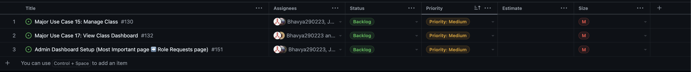

# Team 10's Team Log for Cycle 4

## Sunday, June 16, 2024, 09:14 PM - Tuesday, June 18, 2024, 09:14 PM

## Tasks currently in the Backlog for c-5:
  
  

## Tasks currently in Progress for c-5:
  
  

## Tasks currently in Review for c-5:
  
  

## Tasks Done for c-5:
  
  

## Overall Burn-up Chart of Tasks
For context, On Saturday we reorganized our issues management and milestone management such that each Major Use case became an issue on Saturday. Each milestone (a week) relates to a collection of Use cases we want to complete for the milestone. We also included other more niche issues for things related to the milestone or one of the use-cases.
  
  

## Test Reports for c-5

#### Front-end Testing for c-5
  
  

#### Back-end Testing for c-5
  
  
  
  

# Team 10's Team Log for Cycle 4

## Wednesday, June 12, 2024, 01:07 AM - Friday, June 14, 2024, 01:07 AM

## Tasks currently in the Backlog for c-4:
  
  

## Tasks currently in Progress for c-4:
  
  

## Tasks currently in Review for c-4:
  
  

## Tasks Done for c-4:
  
  

## Overall Burn-up Chart of Tasks
Can't get burn up chart from insights anymore... Github Team issue?
  
  
## Test Reports for c-4

#### Front-end Testing for c-4
  
  

#### Back-end Testing for c-4
No Back-end tests yet, tried writing some for register / login last night but couldn't get them 
to pass.
  
  
# Team 10's Log for Cycle 3

## Friday, June 07, 2024, 11:44 PM - Tuesday, June 11, 2024, 11:44 PM

## Tasks Currently In Backlog this cycle

## Tasks Currently in Progress this cycle 

## Tasks Currently in Review this cycle 

## Tasks Completed this cycle

## Time entries
In individual logs, ask scott about formatting

## Burn-Up Chart 

## Test Reports 
None currently.