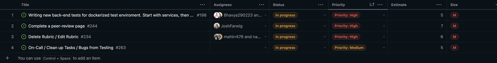
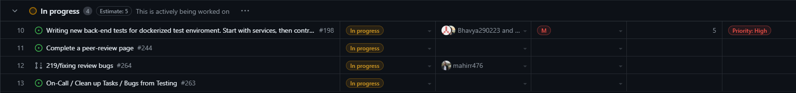
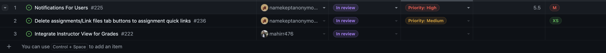
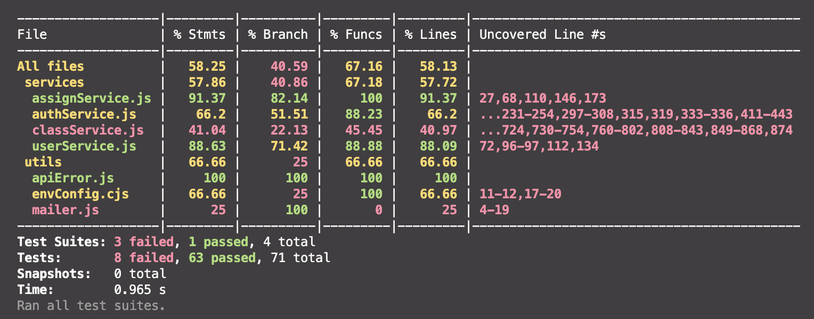
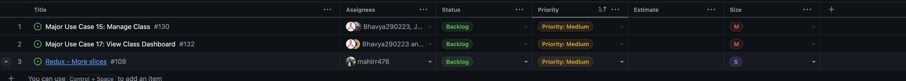

# Team 10's Team Log for Cycle 19

## Thursday, August 01, 2024, 05:22 PM - Tuesday, August 06, 2024, 05:22 PM

## Tasks currently in the Backlog for c-19:

None!  

## Tasks currently in Progress for c-19:

None!  

## Tasks currently in Review for c-19:
  
  

## Tasks Done for c-19:
  
  

## Overall Burn-up Chart of Tasks
  
  

## Test Reports for c-19

#### Front-end Testing for c-19
  
  

#### Back-end Testing for c-19
  
    
  
  

# Team 10's Team Log for Cycle 18

## Tuesday, July 30, 2024, 05:22 PM - Thursday, August 01, 2024, 05:22 PM

## Tasks currently in the Backlog for c-18:
* None for this cycle  

## Tasks currently in Progress for c-18:
  
  

## Tasks currently in Review for c-18:
  
  

## Tasks Done for c-18:
  
  

## Overall Burn-up Chart of Tasks
  
  

## Test Reports for c-18

#### Front-end Testing for c-18
  
  

#### Back-end Testing for c-18
  
    
  
  
  

# Team 10's Team Log for Cycle 17

## Thursday, July 25, 2024, 05:18 PM - Tuesday, July 30, 2024, 05:18 PM

## Tasks currently in the Backlog for c-17:
  
  

## Tasks currently in Progress for c-17:
  
  

## Tasks currently in Review for c-17:
  
  

## Tasks Done for c-17:
  
  

## Overall Burn-up Chart of Tasks
  
  

## Test Reports for c-17

#### Front-end Testing for c-17
  
  

#### Back-end Testing for c-17
  
    
  
  

# Team 10's Team Log for Cycle 16

## Tuesday, July 23, 2024, 05:22 PM - Thursday, July 25, 2024, 05:22 PM

## Tasks currently in the Backlog for c-16:
  
  

## Tasks currently in Progress for c-16:
  
  

## Tasks currently in Review for c-16:
  
  

## Tasks Done for c-16:
  
  

## Overall Burn-up Chart of Tasks
  
  

## Test Reports for c-16

#### Front-end Testing for c-16
  
  

#### Back-end Testing for c-16
  
  
  
  
  

# Team 10's Team Log for Cycle 15

## Thursday, July 18, 2024, 05:23 PM - Tuesday, July 23, 2024, 05:23 PM

## Tasks currently in the Backlog for c-15:
  
  

## Tasks currently in Progress for c-15:
  
  

## Tasks currently in Review for c-15:
  
  

## Tasks Done for c-15:
  
  

## Overall Burn-up Chart of Tasks
  
  

## Test Reports for c-15

#### Front-end Testing for c-15
  
  

#### Back-end Testing for c-15
  
  
  
    
  
  

# Team 10's Team Log for Cycle 14

## Tuesday, July 16, 2024, 06:35 PM - Thursday, July 18, 2024, 06:35 PM

## Tasks currently in the Backlog for c-14:
  
  

## Tasks currently in Progress for c-14:
  
  

## Tasks currently in Review for c-14:
  
  

## Tasks Done for c-14:
  
  

## Overall Burn-up Chart of Tasks
  
  

## Test Reports for c-14

#### Front-end Testing for c-14
  
  

#### Back-end Testing for c-14
  
  
  
  

# Team 10's Team Log for Cycle 13

## Thursday, July 11, 2024, 05:22 PM - Tuesday, July 16, 2024, 05:22 PM

## Tasks currently in the Backlog for c-13:
  
  

## Tasks currently in Progress for c-13:
  
  

## Tasks currently in Review for c-13:
  
  

## Tasks Done for c-13:
  
  

## Burn-up Chart of Tasks
  
  

## Test Reports for c-13
New components are being added and some older components are being refactored. Abdul has been working on tests for existing components that will most likely not change in the next week.
#### Front-end Testing for c-13
  
  

#### Back-end Testing for c-13
#### Unit Tests 
Still need to add integration tests for the rest of the services as well as new ones.
 

#### Integration Tests
 
  
  
  

# Team 10's Team Log for Cycle 12

## Tuesday, July 09, 2024, 05:21 PM - Thursday, July 11, 2024, 05:21 PM

## Tasks currently in the Backlog for c-12:
  
  

## Tasks currently in Progress for c-12:
  
  

## Tasks currently in Review for c-12:
  
  

## Tasks Done for c-12:
  
  

## Overall Burn-up Chart of Tasks
  
  

## Test Reports for c-12

#### Front-end Testing for c-12
  
  

#### Back-end Testing for c-12
#### Unit Tests 
 

#### Integration Tests
 
  
  
  

# Team 10's Team Log for Cycle 11

## Thursday, July 04, 2024, 05:22 PM - Tuesday, July 09, 2024, 05:22 PM

## Tasks currently in the Backlog for c-11:
  
  

## Tasks currently in Progress for c-11:
  
  

## Tasks currently in Review for c-11:
  
  

## Tasks Done for c-11:
  
  

## Overall Burn-up Chart of Tasks
Removed all done tasks since the last cycle, burn up looks relatively low because of creation of lots of new tasks. We also have 5 issues that are currenty in review and will be added to the done section in the next cycle.
  
  

## Test Reports for c-11

### Front-end Testing for c-11
Tests are not passing since there have been alot of changes to the front end componenets, need to refactor front end tests to accomodate for the changes.

  
  

### Back-end Testing for c-11

Back end tests have been split into unit and intregration tests. Unit tests are mocked and integration tests are not. So far some unit tests are failing due to changes to some of the apiService functions.

#### Unit Tests 
classService currently has too many operations outside of its responsibilities, I.E. rubric operations are still in classService, need to remove them
 

#### Integration Tests
  
  
  

# Team 10's Team Log for Cycle 10

## Tuesday, July 02, 2024, 05:21 PM - Thursday, July 04, 2024, 05:21 PM

## Tasks currently in the Backlog for c-10:
  
  

## Tasks currently in Progress for c-10:
  
  

## Tasks currently in Review for c-10:
No tasks currently in Review
  

## Tasks Done for c-10:
  
  

## Overall Burn-up Chart of Tasks
  
  

## Test Reports for c-10

#### Front-end Testing for c-10
  
  

#### Back-end Testing for c-10
  
  
  
  

# Team 10's Team Log for Cycle 9

## Thursday, June 27, 2024, 05:21 PM - Tuesday, July 02, 2024, 05:21 PM

## Tasks currently in the Backlog for c-9:
  
  

## Tasks currently in Progress for c-9:
  
  
## Tasks currently in Review for c-9:
No Tasks currenty in Review for c-9
  

## Tasks Done for c-9:
  
  

## Overall Burn-up Chart of Tasks
  
  
s
## Test Reports for c-9

#### Front-end Testing for c-9
  
  

#### Back-end Testing for c-9
  
  
  
  
s
# Team 10's Team Log for Cycle 8

## Tuesday, June 25, 2024, 05:21 PM - Thursday, June 27, 2024, 05:21 PM

## Tasks currently in the Backlog for c-8:
  
  

## Tasks currently in Progress for c-8:
  
  

## Tasks currently in Review for c-8:
  
  

## Tasks Done for c-8:
  
  

## Overall Burn-up Chart of Tasks
  
  

## Test Reports for c-8

#### Front-end Testing for c-8
  
  

#### Back-end Testing for c-8
  
  
  
  

# Team 10's Team Log for Cycle 7

## Sunday, June 23, 2024, 05:21 PM - Tuesday, June 25, 2024, 05:21 PM

## Tasks currently in the Backlog for c-7:
  
  

## Tasks currently in Progress for c-7:
  
  

## Tasks currently in Review for c-7:
No tasks current in Review 
  

## Tasks Done for c-7:
  
  

## Overall Burn-up Chart of Tasks
  
  

## Test Reports for c-7

#### Front-end Testing for c-7
Most front end tests are passing, the ones that are failing are due to changes to login/register and other 
componenets / dashboard, these tests need to be revised to accomodate for the changes in the components. 
Also the location of our mockData has changed and there was some errs from those as well. 
  
  

#### Back-end Testing for c-7
First mock test was created for the authService with prisma mocking, have to debug envConfig to make more tests for our controllers and routes. 
  
  
  
# Team 10's Team Log for Cycle 6

## Tuesday, June 18, 2024, 05:21 PM - Thursday, June 20, 2024, 05:21 PM

## Tasks currently in the Backlog for c-6:
  
  

## Tasks currently in Progress for c-6:
  
  

## Tasks currently in Review for c-6:
  
  

## Tasks Done for c-6:
  
  

## Overall Burn-up Chart of Tasks
  
  

## Test Reports for c-6

#### Front-end Testing for c-6
  
  

#### Back-end Testing for c-5
Backend testing enviroment still being setup. No automated testing yet. 
  
  

# Team 10's Team Log for Cycle 4

## Sunday, June 16, 2024, 09:14 PM - Tuesday, June 18, 2024, 09:14 PM

## Tasks currently in the Backlog for c-5:
  
  

## Tasks currently in Progress for c-5:
  
  

## Tasks currently in Review for c-5:
  
  

## Tasks Done for c-5:
  
  

## Overall Burn-up Chart of Tasks
For context, On Saturday we reorganized our issues management and milestone management such that each Major Use case became an issue on Saturday. Each milestone (a week) relates to a collection of Use cases we want to complete for the milestone. We also included other more niche issues for things related to the milestone or one of the use-cases.
  
  
## Test Reports for c-5

#### Front-end Testing for c-5
  
  
#### Back-end Testing for c-5
Currenty setting up tesing enviroment with docker-compose, I know shoot me in the foot I deserve it - @JoshFarwig
No backend tests passing yet, there will be backend tests for all auth routes by tonight Jun 19th 2024.

# Team 10's Team Log for Cycle 4

## Wednesday, June 12, 2024, 01:07 AM - Friday, June 14, 2024, 01:07 AM

## Tasks currently in the Backlog for c-4:
  
  

## Tasks currently in Progress for c-4:
  
  

## Tasks currently in Review for c-4:
  
  

## Tasks Done for c-4:
  
  

## Overall Burn-up Chart of Tasks
Can't get burn up chart from insights anymore... Github Team issue?
  
  
## Test Reports for c-4

#### Front-end Testing for c-4
  
  

#### Back-end Testing for c-4
No Back-end tests yet, tried writing some for register / login last night but couldn't get them 
to pass.
  
  
# Team 10's Log for Cycle 3

## Friday, June 07, 2024, 11:44 PM - Tuesday, June 11, 2024, 11:44 PM

## Tasks Currently In Backlog this cycle

## Tasks Currently in Progress this cycle 

## Tasks Currently in Review this cycle 

## Tasks Completed this cycle

## Time entries
In individual logs, ask scott about formatting

## Burn-Up Chart 

## Test Reports 
None currently.
